# Class Diagram for Zealand Eksamens Oversigt

## Complete UML Class Diagram

```mermaid
---
title: Zealand Eksamens Oversigt - Complete Class Diagram
---
classDiagram
    %% Model Classes
    class User {
        +int Uid
        +string Email
        +string FirstName
        +string LastName
        +string PasswordHash
        +DateTime CreatedAt
        +DateTime UpdatedAt
        +DateTime? LastLogin
        +bool IsActive
        +string Role
        +ICollection~UserTeam~ UserTeams
        +UserRole RoleEnum
    }

    class Profile {
        +int Uid
        +string Navn
        +string? Adresse
        +string? MobilNr
        +DateTime CreatedAt
        +DateTime UpdatedAt
        +int uid
    }

    class Session {
        +int SessionId
        +int Uid
        +string SessionToken
        +DateTime CreatedAt
        +DateTime? ExpiresAt
        +User? User
    }

    class CalendarEvent {
        +int EventId
        +int UserId
        +string Title
        +string? Description
        +DateTime SubmissionTime
        +DateTime StartTime
        +DateTime EndTime
        +string? Location
        +bool IsAllDay
        +string Type
        +string Color
        +DateTime CreatedAt
        +DateTime UpdatedAt
        +User? User
        +ICollection~EventParticipant~ Participants
    }

    class EventParticipant {
        +int ParticipantId
        +int EventId
        +int UserId
        +string Status
        +DateTime JoinedAt
        +CalendarEvent? Event
        +User? User
    }

    class Team {
        +int Id
        +string Name
        +string? Description
        +DateTime CreatedAt
        +DateTime UpdatedAt
        +ICollection~UserTeam~ UserTeams
    }

    class UserTeam {
        +int UserId
        +int TeamId
        +DateTime JoinedAt
        +User User
        +Team Team
    }

    class UserRole {
        <<enumeration>>
        Guest
        Student
        Lecturer
        Planner
        Censor
        Admin
    }

    %% Service Classes
    class DatabaseService {
        -ApplicationDbContext _context
        +GetUserByEmailAsync(string email) Task~User?~
        +UpdateLastLoginAsync(int uid) Task
        +CreateUserAsync(string email, string passwordHash) Task~int~
        +GetUserByIdAsync(int uid) Task~User?~
        +GetprofileAsync(int userId) Task~Profile?~
        +GetUserTeamsAsync(int userId) Task~List~Team~~
        +CreateSessionAsync(int uid, int expirationDays) Task~string~
        +ValidateSessionAsync(string sessionToken) Task~int?~
        +DeleteUserSessionsAsync(int uid) Task
        +GetUserIdBySessionTokenAsync(string sessionToken) Task~int?~
    }

    class EventService {
        -ApplicationDbContext _context
        +GetUserEventsAsync(int userId) Task~List~CalendarEvent~~
        +GetUserEventsByDateRangeAsync(int userId, DateTime startDate, DateTime endDate) Task~List~CalendarEvent~~
        +GetEventByIdAsync(int eventId, int userId) Task~CalendarEvent?~
        +CreateEventAsync(CalendarEvent calendarEvent) Task~CalendarEvent~
        +UpdateEventAsync(CalendarEvent calendarEvent) Task~bool~
        +DeleteEventAsync(int eventId, int userId) Task~bool~
        +GetCurrentMonthEventsAsync(int userId, int year, int month) Task~List~CalendarEvent~~
        +AddParticipantAsync(int eventId, int userId, int requestingUserId) Task~bool~
        +RemoveParticipantAsync(int eventId, int userId) Task~bool~
        +UpdateParticipantStatusAsync(int eventId, int userId, string status) Task~bool~
        +GetEventParticipantsAsync(int eventId) Task~List~EventParticipant~~
        +GetUserParticipatingEventsAsync(int userId) Task~List~CalendarEvent~~
        +GetOverlappingEventsAsync(CalendarEvent newEvent, List~int~ participantIds) Task~List~CalendarEvent~~
    }

    class TeamService {
        -ApplicationDbContext _context
        +GetAllTeamsAsync() Task~List~Team~~
        +GetTeamByIdAsync(int teamId) Task~Team?~
        +CreateTeamAsync(string name, string? description) Task~Team~
        +UpdateTeamAsync(int teamId, string name, string? description) Task~bool~
        +DeleteTeamAsync(int teamId) Task~bool~
        +AddUserToTeamAsync(int teamId, int userId) Task~bool~
        +RemoveUserFromTeamAsync(int teamId, int userId) Task~bool~
        +GetTeamMembersAsync(int teamId) Task~List~User~~
        +GetUserTeamsAsync(int userId) Task~List~Team~~
    }

    class Diag_logService {
        +Log(string message)$ void
        +LogError(string message, Exception ex)$ void
        +LogWarning(string message)$ void
        +LogInfo(string message)$ void
    }

    %% Data Context
    class ApplicationDbContext {
        +DbSet~User~ Users
        +DbSet~Profile~ CurrentProfile
        +DbSet~Session~ Sessions
        +DbSet~Team~ Teams
        +DbSet~UserTeam~ UserTeams
        +DbSet~CalendarEvent~ CalendarEvents
        +DbSet~EventParticipant~ EventParticipants
        #OnModelCreating(ModelBuilder modelBuilder) void
    }

    %% PageModel Classes (Presentation Layer)
    class IndexModel {
        -ILogger~IndexModel~ _logger
        +OnGet() void
    }

    class loginModel {
        -DatabaseService _dbService
        -ILogger~loginModel~ _logger
        +string Email
        +string Password
        +string? ErrorMessage
        +OnGetAsync() Task
        +OnPostAsync() Task~IActionResult~
    }

    class logoutModel {
        -DatabaseService _dbService
        +OnGetAsync() Task~IActionResult~
    }

    class ErrorModel {
        -ILogger~ErrorModel~ _logger
        +string? RequestId
        +bool ShowRequestId
        +OnGet() void
    }

    class PrivacyModel {
        -ILogger~PrivacyModel~ _logger
        +OnGet() void
    }

    class KalenderModel {
        -EventService _eventService
        -ApplicationDbContext _context
        -TeamService _teamService
        +List~CalendarEvent~ Events
        +List~User~ AllUsers
        +List~Team~ AllTeams
        +Dictionary~int_List~EventParticipant~~ EventParticipants
        +int CurrentUserId
        +string CurrentUserRole
        +int CurrentYear
        +int CurrentMonth
        +string CurrentMonthName
        +CalendarEvent NewEvent
        +List~int~ SelectedParticipants
        +List~int~ SelectedTeams
        +string? ErrorMessage
        +string? SuccessMessage
        +string? InlineErrorMessage
        +OnGetAsync(int? year, int? month) Task~IActionResult~
        +OnPostCreateEventAsync() Task~IActionResult~
        +OnPostDeleteEventAsync(int eventId) Task~IActionResult~
    }

    class DashboardModel {
        -DatabaseService _dbService
        -ILogger~DashboardModel~ _logger
        +int? userId
        +User? CurrentUser
        +Profile? CurrentProfile
        +List~Team~ Teams
        +OnGetAsync() Task~IActionResult~
        +OnPostManageTeams() Task~IActionResult~
    }

    class ManageModel {
        -TeamService _teamService
        +List~Team~ Teams
        +string? ErrorMessage
        +string? SuccessMessage
        +string CurrentUserRole
        +OnGetAsync() Task~IActionResult~
        +OnPostDeleteAsync(int teamId) Task~IActionResult~
    }

    class CreateModel {
        -TeamService _teamService
        -ApplicationDbContext _context
        +string Name
        +string? Description
        +List~int~ SelectedMembers
        +List~User~ AllUsers
        +string? ErrorMessage
        +OnGetAsync() Task~IActionResult~
        +OnPostAsync() Task~IActionResult~
    }

    class EditModel {
        -TeamService _teamService
        -ApplicationDbContext _context
        +int TeamId
        +string Name
        +string? Description
        +List~int~ SelectedMembers
        +List~User~ AllUsers
        +List~int~ CurrentMemberIds
        +string? ErrorMessage
        +OnGetAsync(int id) Task~IActionResult~
        +OnPostAsync() Task~IActionResult~
    }

    class DetailsModel {
        -TeamService _teamService
        +Team Team
        +List~User~ Members
        +string CurrentUserRole
        +OnGetAsync(int id) Task~IActionResult~
    }

    %% Relationships - Models
    User "1" --> "0..1" Profile : has
    User "1" --> "*" Session : has
    User "1" --> "*" CalendarEvent : creates
    User "1" --> "*" EventParticipant : participates
    User "*" --> "*" Team : belongs to
    
    UserTeam "*" --> "1" User : references
    UserTeam "*" --> "1" Team : references
    
    CalendarEvent "1" --> "*" EventParticipant : has
    
    User ..> UserRole : uses

    %% Relationships - Services and Context
    DatabaseService ..> ApplicationDbContext : uses
    EventService ..> ApplicationDbContext : uses
    TeamService ..> ApplicationDbContext : uses
    
    ApplicationDbContext ..> User : manages
    ApplicationDbContext ..> Profile : manages
    ApplicationDbContext ..> Session : manages
    ApplicationDbContext ..> CalendarEvent : manages
    ApplicationDbContext ..> EventParticipant : manages
    ApplicationDbContext ..> Team : manages
    ApplicationDbContext ..> UserTeam : manages
    
    %% Relationships - PageModels to Services
    loginModel ..> DatabaseService : uses
    logoutModel ..> DatabaseService : uses
    DashboardModel ..> DatabaseService : uses
    
    KalenderModel ..> EventService : uses
    KalenderModel ..> TeamService : uses
    KalenderModel ..> ApplicationDbContext : uses
    
    ManageModel ..> TeamService : uses
    CreateModel ..> TeamService : uses
    CreateModel ..> ApplicationDbContext : uses
    EditModel ..> TeamService : uses
    EditModel ..> ApplicationDbContext : uses
    DetailsModel ..> TeamService : uses
```

## Class Descriptions

### Model Layer (Domain Entities)

#### User
- **Purpose**: Represents a system user with authentication credentials
- **Key Features**: Role-based access control, activity tracking, password hashing with BCrypt
- **Relationships**: Has one Profile, many Sessions, creates CalendarEvents, participates in Events, belongs to Teams

#### Profile
- **Purpose**: Extended user information and personal details
- **Key Features**: Contact information (name, address, mobile number)
- **Relationships**: Belongs to one User (1:1)

#### Session
- **Purpose**: Manages user authentication sessions with token-based authentication
- **Key Features**: Session tokens (32 characters), expiration tracking, cookie persistence
- **Relationships**: Belongs to one User

#### CalendarEvent
- **Purpose**: Represents exam events in the calendar system
- **Key Features**: Event types (written, oral, oral+written, project), time management, participant tracking, color coding, overlap validation
- **Relationships**: Created by one User, has many EventParticipants

#### EventParticipant
- **Purpose**: Junction entity linking users to calendar events
- **Key Features**: Participation status (pending, accepted, declined), join timestamp
- **Relationships**: Links User and CalendarEvent (many-to-many)

#### Team
- **Purpose**: Represents groups or teams of users
- **Key Features**: Team name, description, timestamps
- **Relationships**: Has many Users through UserTeam junction table

#### UserTeam
- **Purpose**: Junction entity for many-to-many User-Team relationship
- **Key Features**: Composite primary key (UserId, TeamId), join timestamp
- **Relationships**: Links User and Team

#### UserRole (Enum)
- **Purpose**: Defines available user roles in the system
- **Values**: Guest, Student, Lecturer, Planner, Censor, Admin
- **Access Levels**: 
  - Guest: Home page only
  - Student/Lecturer/Censor: Profile, calendar view
  - Planner/Admin: Full access including event creation and team management

### Service Layer (Business Logic)

#### DatabaseService
- **Purpose**: Core database operations for users, profiles, sessions, and teams
- **Key Operations**:
  - User authentication and management (`GetUserByEmailAsync`, `CreateUserAsync`)
  - Session creation and validation (`CreateSessionAsync`, `ValidateSessionAsync`)
  - Profile retrieval (`GetprofileAsync`)
  - Team membership queries (`GetUserTeamsAsync`)
  - Session cleanup (`DeleteUserSessionsAsync`)

#### EventService
- **Purpose**: Manages calendar events and participant operations
- **Key Operations**:
  - Event CRUD operations (`CreateEventAsync`, `UpdateEventAsync`, `DeleteEventAsync`)
  - Participant management (`AddParticipantAsync`, `RemoveParticipantAsync`)
  - Event overlap detection (`GetOverlappingEventsAsync`)
  - Date range queries (`GetCurrentMonthEventsAsync`, `GetUserEventsByDateRangeAsync`)
  - Status tracking (`UpdateParticipantStatusAsync`)

#### TeamService
- **Purpose**: Team management and membership operations
- **Key Operations**:
  - Team CRUD operations (`CreateTeamAsync`, `UpdateTeamAsync`, `DeleteTeamAsync`)
  - Member management (`AddUserToTeamAsync`, `RemoveUserFromTeamAsync`)
  - Team membership queries (`GetTeamMembersAsync`, `GetUserTeamsAsync`)
  - Team retrieval with members (`GetTeamByIdAsync`)

#### Diag_logService
- **Purpose**: Static logging utility for diagnostic messages
- **Key Features**: Console logging for debugging (Log, LogError, LogWarning, LogInfo)
- **Usage**: Used throughout the application for troubleshooting

### Data Access Layer

#### ApplicationDbContext
- **Purpose**: Entity Framework Core database context for PostgreSQL
- **Key Features**:
  - Manages all DbSet collections (Users, Profiles, Sessions, Teams, CalendarEvents, etc.)
  - Configures composite keys (UserTeam: UserId + TeamId)
  - UTC datetime conversion for all DateTime properties
  - Relationship configuration (foreign keys, cascades)
- **Database**: PostgreSQL with Npgsql provider

### Presentation Layer (Razor Pages - PageModels)

#### IndexModel
- **Purpose**: Landing page controller
- **Route**: `/Index`
- **Key Features**: Simple home page with logo and welcome message
- **Access**: Public (no authentication required)

#### loginModel
- **Purpose**: User authentication page
- **Route**: `/login`
- **Key Features**:
  - Email/password authentication with BCrypt verification
  - Session creation with 32-character token
  - Cookie-based session persistence
  - Auto-redirect if valid session exists
  - Role-based redirect after login
- **Form Fields**: Email, Password
- **Error Handling**: Displays validation errors inline

#### logoutModel
- **Purpose**: User logout handler
- **Route**: `/logout`
- **Key Features**:
  - Clears all user sessions from database
  - Deletes session cookies
  - Clears in-memory session state
  - Redirects to home page
- **Access**: Requires active session

#### ErrorModel
- **Purpose**: Global error handler page
- **Route**: `/Error`
- **Key Features**: Displays request ID for debugging, no cache policy
- **Access**: Public

#### PrivacyModel
- **Purpose**: Privacy policy page
- **Route**: `/Privacy`
- **Key Features**: Static content page
- **Access**: Public

#### KalenderModel (Dashboard)
- **Purpose**: Calendar and event management page
- **Route**: `/Dashboard/Kalender`
- **Key Features**:
  - Monthly calendar view with navigation
  - Event creation with overlap validation
  - Team and individual participant selection
  - Inline error messages for validation
  - Event deletion
  - Participant tracking
  - Color-coded events by type
- **Access**: Student, Lecturer, Planner, Censor, Admin (no guests)
- **Permissions**: Only Planners and Admins can create/delete events
- **Validation**: Checks for time conflicts across all participants

#### DashboardModel (Profil)
- **Purpose**: User profile display page
- **Route**: `/Dashboard/Profil`
- **Key Features**:
  - Displays user information (email, name, role)
  - Shows user profile details (address, phone)
  - Lists user's team memberships
  - Quick link to team management
- **Access**: Requires active session (non-guest)

#### ManageModel (Teams)
- **Purpose**: Team list and management page
- **Route**: `/Teams/Manage`
- **Key Features**:
  - Lists all teams in the system
  - Team deletion (Planner/Admin only)
  - Links to create, edit, and view team details
- **Access**: All authenticated users except guests
- **Permissions**: Only Planners and Admins can delete teams

#### CreateModel (Teams)
- **Purpose**: Team creation page
- **Route**: `/Teams/Create`
- **Key Features**:
  - Team name and description input
  - Multi-select for initial team members
  - Validates required fields
  - Redirects to management page after creation
- **Access**: Planners and Admins only
- **Validation**: Name required (max 100 characters)

#### EditModel (Teams)
- **Purpose**: Team editing page
- **Route**: `/Teams/Edit`
- **Key Features**:
  - Modify team name and description
  - Add/remove team members
  - Pre-populates existing team data
  - Synchronizes membership changes
- **Access**: Planners and Admins only
- **Operations**: Updates team details and reconciles member list

#### DetailsModel (Teams)
- **Purpose**: Team details view page
- **Route**: `/Teams/Details`
- **Key Features**:
  - Displays team information
  - Lists all team members with details
  - Read-only view
- **Access**: All authenticated users except guests

## Design Patterns

1. **Repository Pattern**: Services act as repositories abstracting data access from presentation layer
2. **Unit of Work**: ApplicationDbContext manages transactions and change tracking
3. **Dependency Injection**: All services and context injected via constructor injection in `Program.cs`
4. **Async/Await**: All database operations are asynchronous for scalability
5. **MVC Pattern**: Razor Pages with PageModel classes (Model-View-Controller variant)
6. **Service Layer Pattern**: Business logic separated into dedicated service classes
7. **DTO Pattern**: Models serve as data transfer objects between layers

## Key Relationships

### Data Layer
- **User ↔ Profile**: One-to-One (each user has one profile)
- **User ↔ Session**: One-to-Many (users can have multiple active sessions)
- **User ↔ CalendarEvent**: One-to-Many (users create events)
- **User ↔ Team**: Many-to-Many (via UserTeam junction)
- **CalendarEvent ↔ User**: Many-to-Many (via EventParticipant junction)

### Service Layer
- Services depend on ApplicationDbContext
- Services return domain models (User, CalendarEvent, Team, etc.)
- Services encapsulate business logic (validation, overlap detection, etc.)

### Presentation Layer
- PageModels depend on Services (DatabaseService, EventService, TeamService)
- Some PageModels access ApplicationDbContext directly for complex queries
- PageModels handle HTTP requests, form binding, and return IActionResult
- PageModels enforce role-based access control

## Architectural Notes

### Three-Tier Architecture
1. **Presentation**: Razor Pages (`.cshtml` views + `.cshtml.cs` PageModels)
2. **Business Logic**: Service classes (DatabaseService, EventService, TeamService)
3. **Data Access**: ApplicationDbContext with Entity Framework Core

### Technology Stack
- **Framework**: ASP.NET Core 9.0 Razor Pages
- **ORM**: Entity Framework Core 9.x
- **Database**: PostgreSQL with Npgsql provider
- **Authentication**: Cookie-based sessions with database persistence
- **Password Hashing**: BCrypt.Net
- **Frontend**: Bootstrap 5, vanilla JavaScript
- **Validation**: Data Annotations + manual business logic validation

### Security Features
- Password hashing with BCrypt (salt rounds: 12)
- Session token validation (32-character random tokens)
- Role-based access control at PageModel level
- HTTPS enforcement
- Anti-forgery tokens on forms
- SQL injection prevention via EF Core parameterization

### Database Considerations
- **Cascade Deletes**: All foreign keys use `ON DELETE CASCADE`
- **Indexes**: Created on frequently queried columns (email, session_token, event dates)
- **UTC Timestamps**: All DateTime values stored and manipulated in UTC
- **Composite Keys**: UserTeam uses (UserId, TeamId) as primary key
- **Check Constraints**: Role and event type validation at database level

## Complete Class Inventory

**Total Classes: 24**

**Models (8):**
1. User
2. Profile
3. Session
4. CalendarEvent
5. EventParticipant
6. Team
7. UserTeam
8. UserRole (enum)

**Services (4):**
9. DatabaseService
10. EventService
11. TeamService
12. Diag_logService

**Data Context (1):**
13. ApplicationDbContext

**PageModels (11):**
14. IndexModel
15. loginModel
16. logoutModel
17. ErrorModel
18. PrivacyModel
19. KalenderModel
20. DashboardModel (Profil)
21. ManageModel (Teams)
22. CreateModel (Teams)
23. EditModel (Teams)
24. DetailsModel (Teams)

All classes have been verified against the source code and are included in the complete class diagram above.

