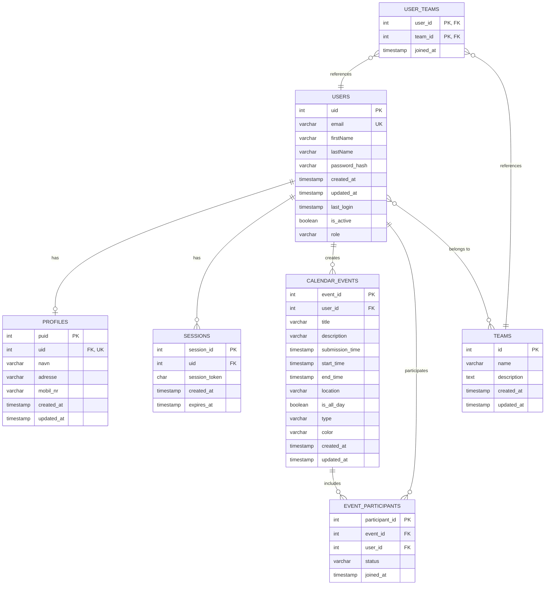

# ER-Diagram for Zealand Eksamens Oversigt Database

## Entity Relationship Diagram

## Relationships Explained

### One-to-One Relationships
- **USERS → PROFILES**: Each user has one profile (1:1)
  - FK: `profiles.uid` → `users.uid`

### One-to-Many Relationships
- **USERS → SESSIONS**: One user can have multiple active sessions (1:N)
  - FK: `sessions.uid` → `users.uid`

- **USERS → CALENDAR_EVENTS**: One user can create multiple calendar events (1:N)
  - FK: `calendar_events.user_id` → `users.uid`

- **CALENDAR_EVENTS → EVENT_PARTICIPANTS**: One event can have multiple participants (1:N)
  - FK: `event_participants.event_id` → `calendar_events.event_id`

### Many-to-Many Relationships
- **USERS ↔ EVENT_PARTICIPANTS**: Users can participate in multiple events (M:N)
  - Junction: `event_participants` table
  - FKs: `event_participants.user_id` → `users.uid`
  - FKs: `event_participants.event_id` → `calendar_events.event_id`

- **USERS ↔ TEAMS**: Users can belong to multiple teams, teams can have multiple users (M:N)
  - Junction: `user_teams` table
  - Composite PK: (`user_id`, `team_id`)
  - FKs: `user_teams.user_id` → `users.uid`
  - FKs: `user_teams.team_id` → `teams.id`

## Database Constraints

### Check Constraints
- **users.role**: Must be one of: `guest`, `student`, `lecturer`, `planner`, `censor`, `admin`
- **calendar_events.type**: Must be one of: `written`, `oral`, `oral+written`, `project`
- **event_participants.status**: Must be one of: `pending`, `accepted`, `declined`

### Unique Constraints
- **users.email**: Each email must be unique
- **profiles.uid**: Each user can only have one profile
- **event_participants (event_id, user_id)**: A user can only participate once per event
- **user_teams (user_id, team_id)**: Composite primary key ensures unique team membership

### Cascade Rules
All foreign keys use `ON DELETE CASCADE`, meaning:
- Deleting a user automatically deletes their sessions, profile, events, and team memberships
- Deleting an event automatically deletes all participant records
- Deleting a team automatically removes all user memberships

## Indexes

### users
- `idx_users_email` on `email`
- `idx_users_active` on `is_active`

### sessions
- `idx_session_token` on `session_token`
- `idx_session_uid` on `uid`

### calendar_events
- `idx_calendar_events_user_id` on `user_id`
- `idx_calendar_events_start_time` on `start_time`

### event_participants
- `idx_event_participants_event_id` on `event_id`
- `idx_event_participants_user_id` on `user_id`
- `idx_event_participants_status` on `status`

### user_teams
- `idx_user_teams_user_id` on `user_id`
- `idx_user_teams_team_id` on `team_id`
